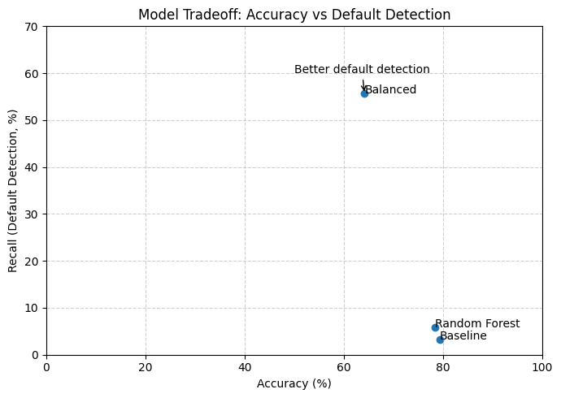

# When Credit Falls Short, Data Can Fill the Gap

## Hook

How do you prove that your trustworthy when you have no history to be evaluated on? For a lot of people, they are unable to get loans not because they are financially risky, but because they lack the credit history to be evaluated using current metrics.

## Problem statement
Traditional loan risk models heavily rely on using past credit history to evaluate borrowers.  For those with little to no credit history this proves a problem, as they lack a key peice of the evaluation.  While there are other ways to be evaluated, they prove harder and make more work for the financial institutions and the borrower.  As a result, many people struggle to get loans even though they may be financially responsible.

## Solution description

This project offers a new way to evaluate borrowers by looking beyond traditional credit scores. Instead of relying only on past credit history, it considers a broader set of financial factors—such as income, existing debt, and loan details—to better understand a person’s ability to repay a loan.

By bringing this information together, the model builds a clearer picture of borrowers who may not have an established credit history. The analysis focuses specifically on individuals who are often overlooked by traditional systems, helping to identify patterns that signal financial risk.

The results show that common approaches can appear accurate while still missing many borrowers who are likely to default. By adjusting the way risk is measured, this project improves the ability to identify those higher-risk cases, which is critical for lenders.

Overall, this approach creates a more balanced and fair way to evaluate borrowers—helping financial institutions make smarter decisions while giving more people a chance to access credit.

### Diagram

As seen below, around 45 million people in the US are credit invisible.
https://www.cnbc.com/2015/05/05/credit-invisible-26-million-have-no-credit-score.html

